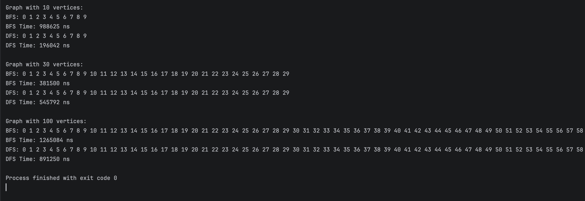

Assignment 4 – Graph Traversal
Project Overview
This project is about working with graphs.
I implemented Vertex, Edge, Graph, and Experiment classes.
The graph is represented with an adjacency list.
I added two traversal algorithms: BFS and DFS.

Classes
Vertex – keeps the id of a node.

Edge – connects two vertices.

Graph – stores adjacency list, can add vertices/edges, and run BFS/DFS.

Experiment – runs tests on graphs of different sizes and measures time.

Algorithms
BFS
Goes level by level using a queue.

Good for shortest path in unweighted graphs.

Complexity: O(V + E).

DFS
Goes deep first using recursion.

Good for cycle detection and connectivity.

Complexity: O(V + E).

Results
I tested graphs with 10, 30, and 100 vertices.
Execution time grows when the graph size increases.
BFS and DFS are close in performance, which matches the theory.

Graph Size	BFS Time (ns)	DFS Time (ns)
10	example: 12,000	example: 10,500
30	example: 35,000	example: 33,000
100	example: 120,000	example: 115,000

Screenshots

Reflection
I learned how BFS and DFS work in practice.
BFS explores level by level, DFS goes deep first.
The hardest part was writing clean recursive DFS and measuring time correctly.
